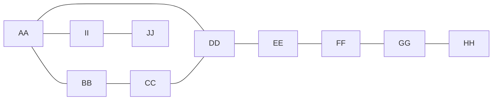
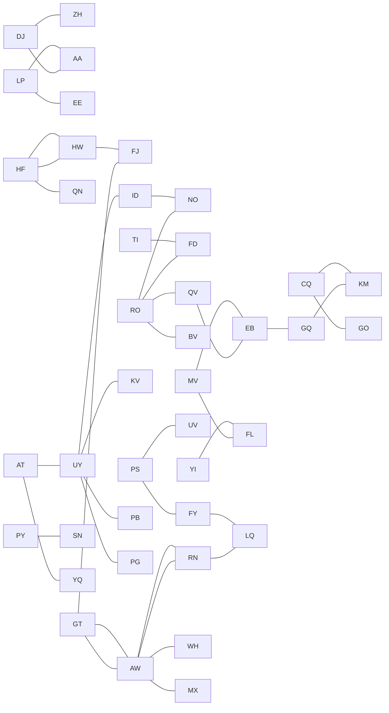

BV0 RO, ZH
PB0 UY, AA
MX0 AW, YG
DE4 MM, PZ, PG, DS, EP
AA0 EP, PB, LP, JT, DJ
QN23 SN, HF
GO0 CQ, MK
PZ0 IJ, DE
PG0 UY, DE
FL18 MV, YI
DS0 DE, ZH
ZH11 YQ, BV, DJ, DS, SB
KV0 UY, IJ
UV9 MM, PS, YG
WH0 JT, AW
FD0 YI, RO
FJ24 HW, GT
JT0 AA, WH
SN0 PY, QN
KM0 GQ, CQ
LQ0 RN, FY
NO0 ID, RO
SB0 ZH, IJ
MK25 GO
YG0 MX, UV
IJ16 EE, KV, PZ, SB
EP0 AA, DE
MM0 UV, DE
YQ0 AT, ZH
EE0 LP, IJ
