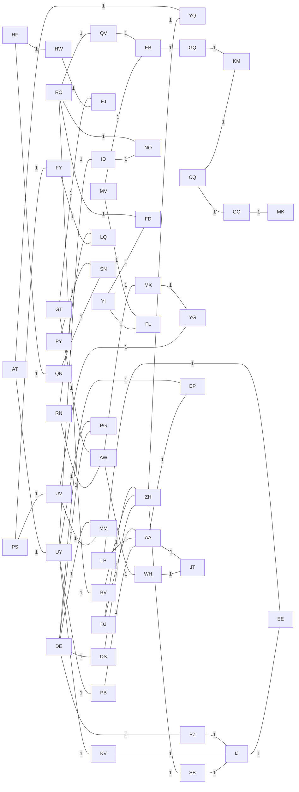
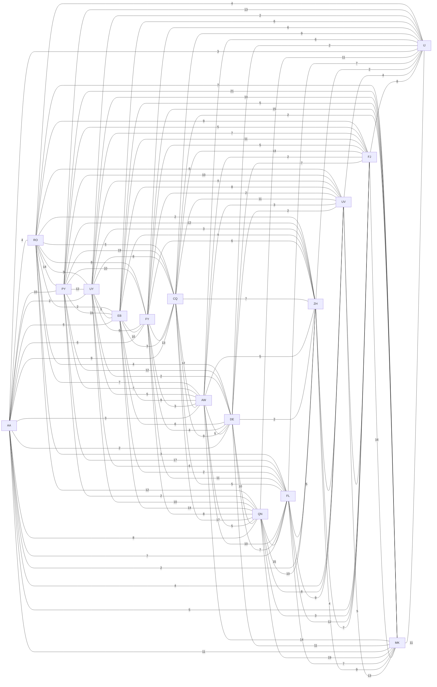

### Original

```mermaid
flowchart LR
DJ -- 1 --- ZH
DJ -- 1 --- AA
LP -- 1 --- AA
LP -- 1 --- EE
GT -- 1 --- FJ
GT -- 1 --- AW
RO -- 1 --- NO
RO -- 1 --- FD
RO -- 1 --- QV
RO -- 1 --- BV
PS -- 1 --- FY
PS -- 1 --- UV
QV -- 1 --- EB
MV -- 1 --- FL
MV -- 1 --- EB
RN -- 1 --- AW
RN -- 1 --- LQ
HF -- 1 --- QN
HF -- 1 --- HW
PY -- 1 --- SN
AT -- 1 --- YQ
AT -- 1 --- UY
UY -- 1 --- KV
UY -- 1 --- ID
UY -- 1 --- PB
UY -- 1 --- PG
YI -- 1 --- FL
YI -- 1 --- FD
EB -- 1 --- GQ
ID -- 1 --- NO
FY -- 1 --- LQ
GQ -- 1 --- KM
HW -- 1 --- FJ
CQ -- 1 --- KM
CQ -- 1 --- GO
AW -- 1 --- WH
AW -- 1 --- MX
BV -- 1 --- ZH
PB -- 1 --- AA
MX -- 1 --- YG
DE -- 1 --- MM
DE -- 1 --- PZ
DE -- 1 --- PG
DE -- 1 --- DS
DE -- 1 --- EP
AA -- 1 --- EP
AA -- 1 --- JT
QN -- 1 --- SN
GO -- 1 --- MK
PZ -- 1 --- IJ
DS -- 1 --- ZH
ZH -- 1 --- YQ
ZH -- 1 --- SB
KV -- 1 --- IJ
UV -- 1 --- MM
UV -- 1 --- YG
WH -- 1 --- JT
SB -- 1 --- IJ
IJ -- 1 --- EE

```

Total nodes: 50.

### New

```mermaid
flowchart LR
RO -- 14 --- PY
RO -- 3 --- UY
RO -- 2 --- EB
RO -- 8 --- FY
RO -- 5 --- CQ
RO -- 7 --- AW
RO -- 4 --- DE
RO -- 12 --- QN
RO -- 3 --- FL
RO -- 2 --- ZH
RO -- 6 --- UV
RO -- 9 --- FJ
RO -- 7 --- MK
RO -- 4 --- IJ
PY -- 12 --- UY
PY -- 16 --- EB
PY -- 10 --- FY
PY -- 19 --- CQ
PY -- 7 --- AW
PY -- 12 --- DE
PY -- 2 --- QN
PY -- 17 --- FL
PY -- 12 --- ZH
PY -- 10 --- UV
PY -- 5 --- FJ
PY -- 21 --- MK
PY -- 13 --- IJ
UY -- 5 --- EB
UY -- 6 --- FY
UY -- 8 --- CQ
UY -- 5 --- AW
UY -- 2 --- DE
UY -- 10 --- QN
UY -- 6 --- FL
UY -- 3 --- ZH
UY -- 4 --- UV
UY -- 7 --- FJ
UY -- 10 --- MK
UY -- 2 --- IJ
EB -- 10 --- FY
EB -- 3 --- CQ
EB -- 9 --- AW
EB -- 6 --- DE
EB -- 14 --- QN
EB -- 2 --- FL
EB -- 4 --- ZH
EB -- 8 --- UV
EB -- 11 --- FJ
EB -- 5 --- MK
EB -- 6 --- IJ
FY -- 13 --- CQ
FY -- 3 --- AW
FY -- 4 --- DE
FY -- 8 --- QN
FY -- 11 --- FL
FY -- 6 --- ZH
FY -- 2 --- UV
FY -- 5 --- FJ
FY -- 15 --- MK
FY -- 6 --- IJ
CQ -- 12 --- AW
CQ -- 9 --- DE
CQ -- 17 --- QN
CQ -- 5 --- FL
CQ -- 7 --- ZH
CQ -- 11 --- UV
CQ -- 14 --- FJ
CQ -- 2 --- MK
CQ -- 9 --- IJ
AW -- 5 --- DE
AW -- 5 --- QN
AW -- 10 --- FL
AW -- 5 --- ZH
AW -- 3 --- UV
AW -- 2 --- FJ
AW -- 14 --- MK
AW -- 6 --- IJ
DE -- 10 --- QN
DE -- 7 --- FL
DE -- 2 --- ZH
DE -- 2 --- UV
DE -- 7 --- FJ
DE -- 11 --- MK
DE -- 2 --- IJ
AA -- 4 --- RO
AA -- 10 --- PY
AA -- 2 --- UY
AA -- 6 --- EB
AA -- 6 --- FY
AA -- 9 --- CQ
AA -- 3 --- AW
AA -- 2 --- DE
AA -- 8 --- QN
AA -- 7 --- FL
AA -- 2 --- ZH
AA -- 4 --- UV
AA -- 5 --- FJ
AA -- 11 --- MK
AA -- 3 --- IJ
QN -- 15 --- FL
QN -- 10 --- ZH
QN -- 8 --- UV
QN -- 3 --- FJ
QN -- 19 --- MK
QN -- 11 --- IJ
FL -- 5 --- ZH
FL -- 9 --- UV
FL -- 12 --- FJ
FL -- 7 --- MK
FL -- 7 --- IJ
ZH -- 4 --- UV
ZH -- 7 --- FJ
ZH -- 9 --- MK
ZH -- 2 --- IJ
UV -- 5 --- FJ
UV -- 13 --- MK
UV -- 4 --- IJ
FJ -- 16 --- MK
FJ -- 8 --- IJ
MK -- 11 --- IJ

```

Total nodes: 16.
